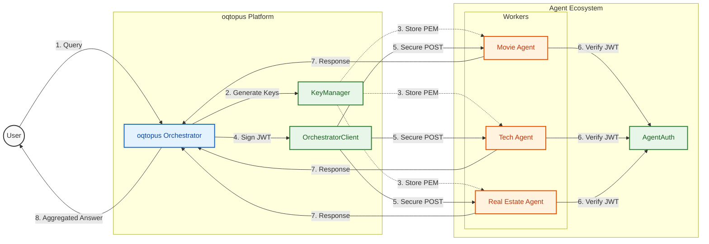

<p align="center">
  
  
  
</p>

<h1 align="center">🐙 oqtopus</h1>

<p align="center">
  <strong>The AI Agent Orchestration Platform</strong><br/>
  <em>Route queries to specialized agents. Aggregate responses. Unified AI experience.</em>
</p>

<p align="center">
  <a href="https://www.oqtopus.dev"><strong>🌐 Live Platform: www.oqtopus.dev</strong></a>
</p>

---

> [!WARNING]
> **IMPORTANT SECURITY NOTICE regarding Crypto Scams**
> 
> **oqtopus is a strictly open-source software project.** > 
> * We do **NOT** have a token, coin, cryptocurrency, or NFT.
> * We are **NOT** asking for investments or conducting any presales.
> * Any social media accounts (Twitter/X, Telegram) claiming to be "Oqtopus" and promoting tokens (e.g., `$OQTO`, `$TOPUS`) are **SCAMS**.
> * The only official source of truth is this GitLab/GitHub repository and the website linked above.
> 
> **Do not send money to anyone claiming to represent this project.**

---

## 🎯 What is oqtopus?

**oqtopus** is a distributed AI agent orchestration platform that intelligently routes user queries to specialized agents based on category classification. It acts as a central hub that:

1. **Classifies** incoming queries using Google Gemini LLM
2. **Routes** requests to the most appropriate registered agents
3. **Aggregates** responses from multiple agents
4. **Synthesizes** a unified answer for the user

Think of it as an **API gateway for AI agents** — but smarter.

## 🏗️ How oqtopus Works with rotagent

oqtopus relies on the [**rotagent**](https://pypi.org/project/rotagent/) Python package for secure agent communication:



### Component Relationship

| Component | Role | Uses from rotagent |
|-----------|------|-------------------|
| **oqtopus** | Orchestrator | `KeyManager` (generate keypairs), `OrchestratorClient` (sign requests) |
| **Agents** | Specialized services | `AgentAuth` (verify JWT), `DevTools` (development keys) |

## ✨ Key Features

### 🎛️ Agent Management
- **Self-Service Registration** — Register your agent via web UI
- **Multi-Category Support** — Agents can serve multiple query categories
- **Public/Private Visibility** — Control whether your agent appears publicly
- **RSA Key Generation** — Automatic secure key generation on registration

### 🔐 Enterprise Security
- **JWT-Based Authentication** — RS256 signed tokens
- **Replay Attack Protection** — Token ID (JTI) tracking
- **Body Tampering Detection** — SHA-256 content verification
- **Isolated Key Storage** — Each agent gets unique keypair

### 🧠 Intelligent Routing
- **LLM-Powered Classification** — Google Gemini categorizes queries
- **Dynamic Output Structure** — Agents receive expected response format
- **Parallel Agent Calls** — Async requests to multiple agents
- **Fallback Responses** — Built-in LLM fallback if agents fail

### 👤 User Management
- **Authentication System** — Login/Register with email
- **Rate Limiting** — 5 requests/day for users, 1/day for guests
- **Agent Ownership** — Only owners can edit/delete their agents

## 📁 Project Structure

```
oqtopus/
├── app.py                          # Application entry point
├── agent_package/
│   ├── __init__.py                 # App factory, LLM & DB initialization
│   ├── config.py                   # Environment configuration
│   ├── entrypoint_layer/           # API Routes
│   │   ├── auth_router.py          # Login/Register endpoints
│   │   ├── info_router.py          # User dashboard, agent listing
│   │   ├── modify_router.py        # Agent CRUD operations
│   │   └── search_router.py        # Query processing & routing
│   ├── domain_layer/               # Business logic
│   │   ├── route_class_domain.py   # Category definitions, Pydantic models
│   │   └── pk_storage_base.py      # Storage interface
│   ├── repository_layer/           # Data access
│   │   ├── gemini_llm.py           # Google Gemini integration
│   │   └── openai_llm.py           # OpenAI integration (alternative)
│   ├── system_layer/               # Infrastructure
│   │   ├── databases_registry/     # MongoDB/SQLite adapters
│   │   ├── pk_storage/             # Private key storage
│   │   └── utils.py                # Agent registry, request signing
│   ├── static/                     # CSS, assets
│   └── templates/                  # Jinja2 HTML templates
├── requirements.txt                # Python dependencies
└── orchestrator_data.json          # Local agent registry (dev mode)
```

## 🚀 Deployment

The platform is deployed and available at: **[www.oqtopus.dev](https://www.oqtopus.dev)**

### Registering Your Agent

1. **Visit** [www.oqtopus.dev](https://www.oqtopus.dev)
2. **Create an account** or log in
3. **Click "Register New Agent"**
4. **Fill in the form:**
   - **Name**: Your agent's display name
   - **URL**: Your agent's public endpoint (e.g., `https://my-agent.com`)
   - **Categories**: Select relevant categories (Movie, Tech, Real Estate, etc.)
   - **Description**: Brief description of what your agent does
   - **Orchestrator ID**: Unique lowercase identifier (e.g., `my_agent_v1`)
   - **Public**: Check if you want it visible to all users
5. **Download the `.pem` file** after registration
6. **Place it in your agent's `authorized_keys/` folder**

Your agent now receives authenticated requests from oqtopus!

## 🔧 Environment Variables

| Variable | Description | Required                       |
|----------|-------------|--------------------------------|
| `APP_ENV` | Set to `production` for production mode, otherwise defaults to development | No (default: `development`)    |
| `GEMINI_API_KEY` | Google Gemini API key | Yes (if using Gemini)          |
| `GEMINI_VERSION` | Gemini model version (e.g., `gemini-pro`) | No (default: latest)           |
| `OPENAI_API_KEY` | OpenAI API key | Yes (if using OpenAI)          |
| `LLM_PROVIDER` | LLM provider to use: `gemini` or `openai` | No (default: `gemini`)         |
| `PK_STORAGE_TYPE` | Private key storage type: `local` or `mongodb` | No (default: `local`)          |
| `SECRET_KEY` | Flask secret key for session security. Generate with: `python -c "import secrets; print(secrets.token_hex(32))"` | Yes (production)               |
| `PK_ENCRYPTION_SALT` | Salt for private key encryption. Generate with: `python -c "import secrets; print(secrets.token_hex(32))"` | Yes (production)               |
| `MONGO_DB_USER` | MongoDB username | Yes (if using MongoDB)         |
| `MONGO_DB_PASS` | MongoDB password | Yes (if using MongoDB)         |
| `MONGO_DB_REST_URL` | MongoDB connection URL | Yes (if using MongoDB)         |
| `MONGO_DB_NAME` | MongoDB database name (production) | Yes (if using MongoDB)         |
| `MONGO_DB_NAME_TEST` | MongoDB database name (development/test) | No                             |
| `SENDER_EMAIL` | Email address for sending contact form emails | Yes (if contact form enabled)  |
| `SENDER_APP_PASSWORD` | App password for the sender email (e.g., Gmail app password) | Yes (if contact form enabled)  |
| `SMTP_SERVER` | SMTP server address | No (default: `smtp.gmail.com`) |
| `SMTP_PORT` | SMTP server port | No (default: `587`)            |
| `RECIPIENT_EMAIL` | Email address to receive contact form submissions | Yes (if contact form enabled)   |


## 🔌 API Reference

### `POST /search`

Process a user query and route to matching agents.

**Request:**
```json
{
  "query": "What are the best sci-fi movies of 2023?"
}
```

**Response (NDJSON Stream):**
```json
{"type": "quota", "data": {"remaining": 4, "max": 5}}
{"type": "category", "data": "Movie"}
{"type": "agents", "data": [{"agent_url": "https://...", "result": {...}}]}
{"type": "final", "data": "Based on the data, the best sci-fi movies..."}
```

### `POST /register-agent`

Register a new agent (requires authentication).

### `GET /my-agents`

List all agents owned by the current user (requires authentication).

## 🔗 Related Projects

| Project | Description | Link |
|---------|-------------|------|
| **rotagent** | Authentication library for agent-orchestrator communication | [PyPI](https://pypi.org/project/rotagent/) \| [GitHub](https://github.com/yaruchyo/rotagent) |
| **example-agent** | Sample agent implementation template | [GitHub](https://github.com/yaruchyo/example-agent) |

## 🛠️ Tech Stack

- **Backend**: Flask (Python)
- **LLM**: Google Gemini / OpenAI
- **Database**: MongoDB (production) / SQLite (development)
- **Authentication**: Flask-Login + rotagent JWT
- **Styling**: Custom CSS with modern dark theme

## 📊 Query Flow

```
User Query: "What are the best sci-fi movies of 2023?"
                    │
                    ▼
    ┌───────────────────────────────────┐
    │  1. CLASSIFY (Gemini LLM)          │
    │     → Category: "Movie"            │
    │     → Output Structure: {...}      │
    └───────────────────────────────────┘
                    │
                    ▼
    ┌───────────────────────────────────┐
    │  2. FETCH AGENTS                   │
    │     → Find all "Movie" agents      │
    │     → Sign JWT requests (rotagent) │
    │     → Parallel async calls         │
    └───────────────────────────────────┘
                    │
            ┌───────┴───────┐
            ▼               ▼
    ┌──────────────┐ ┌──────────────┐
    │ Movie Agent  │ │ Built-in LLM │
    │   Response   │ │   Fallback   │
    └──────────────┘ └──────────────┘
            │               │
            └───────┬───────┘
                    ▼
    ┌───────────────────────────────────┐
    │  3. SYNTHESIZE (Gemini LLM)        │
    │     → Aggregate all responses     │
    │     → Generate unified answer     │
    └───────────────────────────────────┘
                    │
                    ▼
              Final Response
```

## 🤝 Contributing

Contributions are welcome! Key areas:

- **New Categories**: Update `CATEGORIES` in `agent_package/domain_layer/route_class_domain.py`
- **LLM Providers**: Add new providers in `repository_layer/`
- **Storage Backends**: Implement new storage adapters in `system_layer/`

## 📝 License

MIT License - See [LICENSE](LICENSE) for details.

---

<p align="center">
  <strong>🐙 oqtopus</strong> — <em>Your AI queries, expertly routed.</em><br/>
  <a href="https://www.oqtopus.dev">www.oqtopus.dev</a>
</p>
